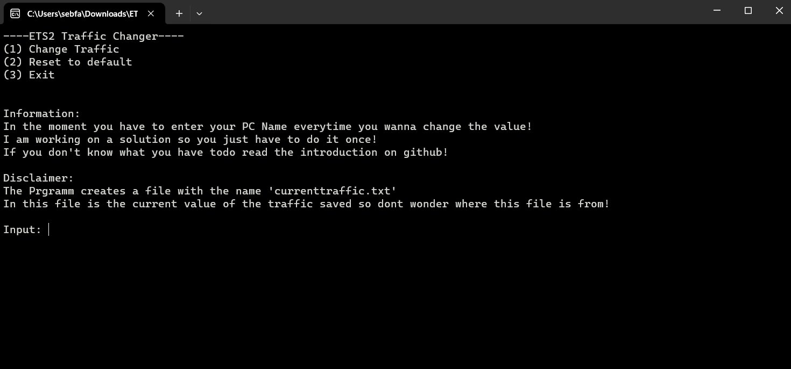
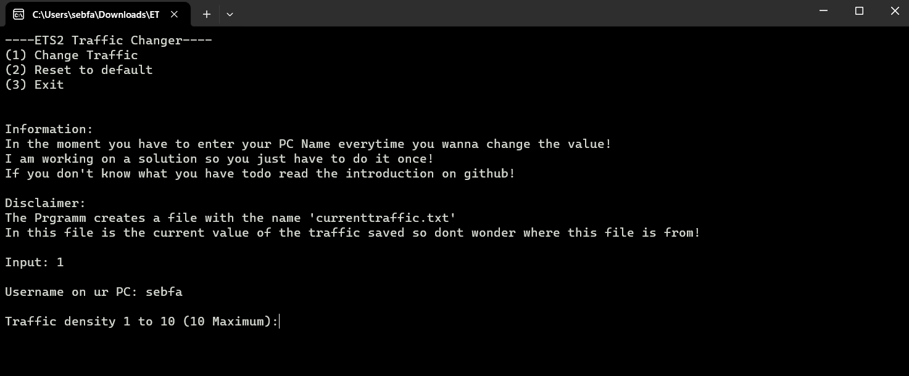
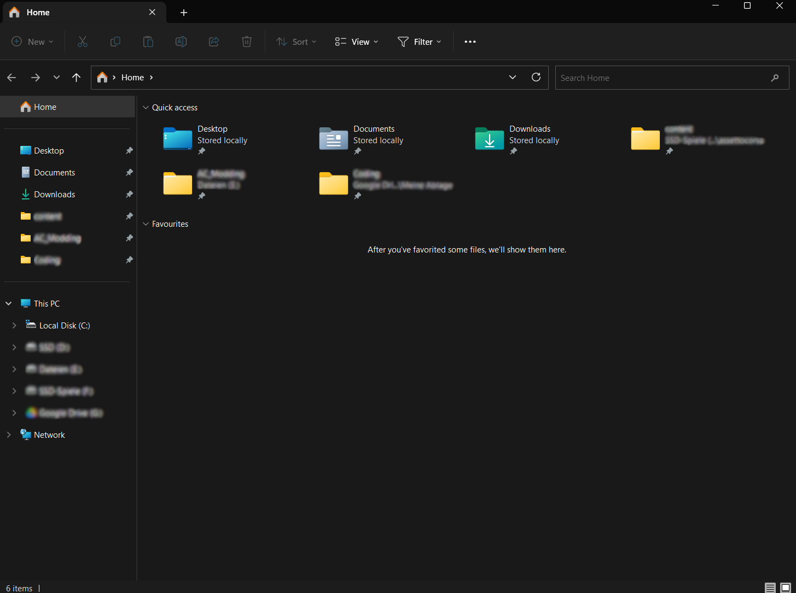
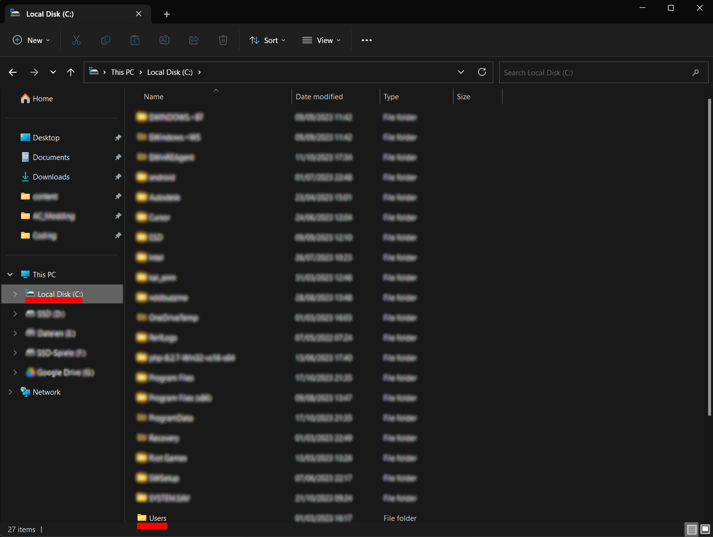
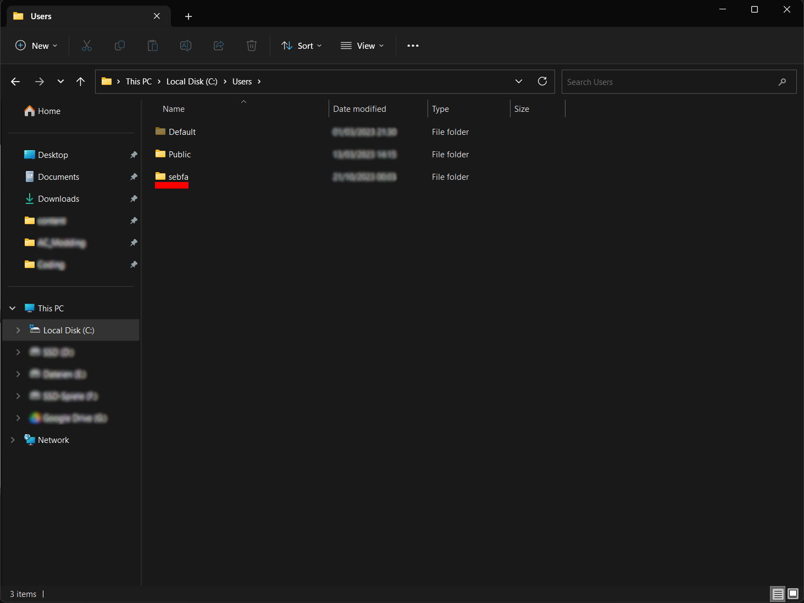

# ETS2 traffic density changer

With this small programm you can change the densitiy of youre traffic in ETS 2

### How to start:

    If youre game is running close it now!

When starting the programm you see this menu:

To change the density enter 1 and press enter.

The next step is to enter youre PC Username!  
If you dont know what your PC Username is read the text below!
 

After that it should look like that:

In this field you enter the amount of traffic.  
**10** is the maximum  
 **1** is the minimum   
 Press enter and you are ready to go!

   
### How to find the PC Username: 

1. Open up the Explorer

    When opening youre explorer it should look something like this

    

  

2. On the left hand side click on Local Disk (C:) and search for the folder **"Users"**

    

  

3. In the folder **"Users"** you find all youre users on the pc. The name of the folder is youre username in my case it's "sebfa"

    

### Somethin not working?

Message me on Github or on Discord  

Discord: psydooo

